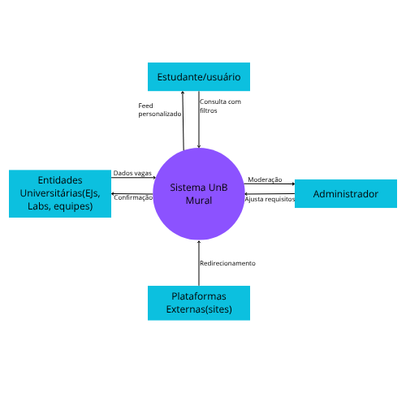
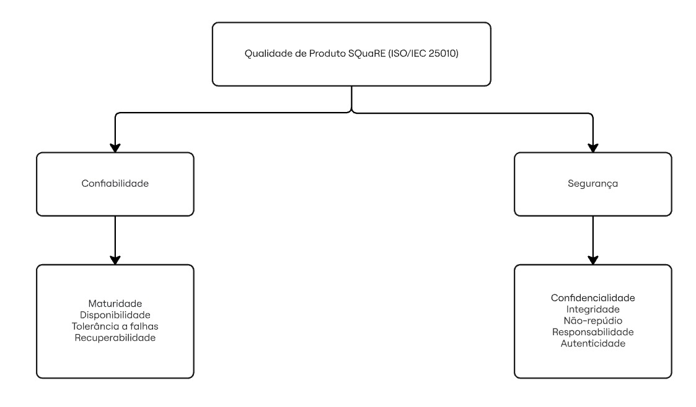

# Fase 1: Planejamento da Avaliação

Esta página unifica todos os tópicos da Fase 1, fornecendo uma visão completa e contínua do planejamento da avaliação de qualidade. Utilize o menu de navegação lateral para pular rapidamente para qualquer seção (âncoras).

---

## 1. Requisitante e partes interessadas
[Inserir texto aqui]

---

## 2. Descrição estruturada do software
O objetivo desta página é descrever como o produto de software que está sendo avaliado é estruturado e os pontos de relevâncias para o estudo proposto. 

### 2.1 Informações Básicas

- **Nome do Produto:** Mural UnB
- **Versão do Produto:** 1.0.0
- **Data da Release da Versão:** 02 de Dezembro de 2025 
- **Aplicação do Produto:** Encotrar oportunidades dentro da UnB
- **Modúlos do Produto:** Feed, Mural, Sobre e Documentação
- **Repositório do Código Principal:** [GitHub](https://github.com/unb-mds/2025-2-Mural-UnB) 
- **Licença do Produto:** MIT license

### 2.2 Sobre o uso do Unb Mural
- **Funções do Produto:** Busca de eventos, projetos e empresas juniores e Priorização de feed com machine learning.
- **Público Alvo:** Alunos da UnB
- **Dispositivos:** É responsivo para Desktop, Notebook e Smartphones.
- **Conectividade:** WEB-Online

**Diagrama de Contexto**
  
<figure align="center">
   
   <figcaption>Autor: Carlos</figcaption>
</figure>

---

## 3. Propósito da avaliação e uso pretendido dos resultados

**Propósito da avaliação:**
O principal propósito desta avaliação é essencialmente didático e pedagógico, focado na aplicação prática das técnicas de avaliação de qualidade de produto de software estabelecidas pelos modelos e normas da família SQuaRE. Por meio dessa execução, a equipe avaliadora busca desenvolver e aprimorar suas capacidades críticas e analíticas ao analisar um sistema real. A avaliação visa não apenas evidenciar os pontos fortes da arquitetura do sistema , mas também mapear e expor suas vulnerabilidades atuais.

**Uso pretendido dos resultados:**
Os dados e diagnósticos obtidos com a avaliação serão utilizados em duas frentes principais. Primeiramente, servirão para que a própria equipe de avaliação consolide seu aprendizado prático em engenharia de software, adquirindo proficiência na condução de avaliações de qualidade formais. Em segundo lugar, os resultados fornecerão um diagnóstico claro e acionável para a equipe de desenvolvimento do Mural UnB, servindo como um roteiro de melhoria contínua para futuros colaboradores do projeto. A expectativa é que essas descobertas permitam reforçar as boas práticas já existentes e mitigar as falhas identificadas, fazendo com que o projeto vá além do seu fim puramente didático e contribua ativamente para a evolução do Mural UnB como uma ferramenta open source útil, segura e sustentável para a comunidade acadêmica da universidade.

---

## 4. Modelo de Qualidade

O modelo adotado é o **Modelo de Qualidade do Produto SQuaRE (ISO/IEC 25010)**. O modelo de qualidade do produto originalmente categoriza as propriedades de qualidade do produto de software em oito características: adequação funcional, eficiência de desempenho, compatibilidade, usabilidade, confiabilidade, segurança, manutenibilidade e portabilidade. Cada característica é composta por um conjunto de subcaracterísticas relacionadas.

> Figura: Diagrama Qualidade de Produto. Fonte: Norma 25010

### 4.1 Adaptação do Modelo

Adaptamos o modelo SQuaRE (ISO/IEC 25010) original para ignorar as visões de "Manufatura" (concentrada em processos internos de codificação) e pela ideia de focar estritamente na **Visão do Produto** e **Visão do Usuário**. Além de não selecionarmos usabilidade pela restrição da atividade. Essas escolha são justificadas pelas necessidades dos principais stakeholders (estudantes, professores e administração), que dependem da veracidade absoluta e do acesso ininterrupto às informações acadêmicas oficiais.

Então, selecionamos as características desejadas por meio da fórmula: **Prioridade = Peso × (Impacto × Risco)**. Isso permite focar nos riscos críticos da persona, evitando avaliações de subcaracterísticas de baixo valor para o nosso objetivo. Falaremos mais sobre a escolha e priorizações no próximo tópico.

Assim, para esta avaliação foram selecionadas as seguintes características:

**SQuaRE (ISO/IEC 25010)**

1. **Confiabilidade (Reliability)**: Define o grau em que o sistema executa funções específicas sob condições estabelecidas por um período de tempo.
2. **Segurança (Security)**: Fundamental para proteger os dados e as informações contra acessos e modificações não autorizadas.

### 4.2 Diagrama Adaptado (visão geral)

O diagrama abaixo foca na hierarquia das qualidades selecionadas para o Mural UnB:

> Figura: Diagrama Qualidade de Produto. Autor: Lucas

--- 

## 5. Seleção de Características

Como visto acima, selecionamos Confiabilidade e Segurança.

### 5.1 Justificativa de Priorização

A justificativa de priorização reside no fato de o Mural UnB lidar com avisos oficiais e horários. A **Confiabilidade** é prioritária para garantir que o serviço não fique indisponível durante períodos críticos (como a matrícula). Enquanto a **Segurança** é essencial para evitar que usuários não autorizados alterem informações públicas, o quê causaria desinformação na comunidade acadêmica.

### 5.2 Classificação de Subcaracterísticas (Escala 1 a 5)

1. **Confiabilidade (Reliability)**: 
    * Subcaracterísticas: Maturidade, Disponibilidade, Tolerância a Falhas, Recuperabilidade.
2. **Segurança (Security)**: 
    * Subcaracterísticas: Confidencialidade, Integridade, Não-repúdio, Responsabilidade, Autenticidade.

#### Confiabilidade (Reliability)

**Definição**: Mede o grau em que um sistema, componente ou processo executa funções específicas sob condições estabelecidas por um período de tempo determinado.

**Classificação das Subcaracterísticas do modelo SQuaRE (ISO/IEC 25010):**

| Subcaracterística | Ênfase (1-5) | Definição Breve | Justificativa Curta |
| :--- | :---: | :--- | :--- |
| **Disponibilidade** | 5 | Grau em que o sistema está operacional e acessível. | Vital para que o Mural UnB esteja acessível em períodos críticos de matrícula. |
| **Maturidade** | 3 | Atendimento das necessidades de confiabilidade em operação normal. | Relevante para estabilidade a longo prazo após a fase inicial de lançamento. |
| **Tolerância a Falhas** | 4 | Capacidade de manter a operação pretendida mesmo com falhas de HW/SW. | Importante para evitar quedas totais por erros pontuais no backend. |
| **Recuperabilidade** | 4 | Capacidade de recuperar dados e o estado operacional após interrupção. | Essencial para garantir a persistência das notícias após quedas de servidor. |

#### Segurança (Security)

**Definição**: A segurança foca na proteção das informações e dados para garantir que apenas pessoas autorizadas acessem os dados.

**Classificação das Subcaracterísticas do modelo SQuaRE (ISO/IEC 25010):**

| Subcaracterística | Ênfase (1-5) | Definição Breve | Justificativa Curta |
| :--- | :---: | :--- | :--- |
| **Integridade** | 5 | Prevenção de acesso ou modificação não autorizada de dados. | Crítica para impedir que notícias falsas sejam publicadas por terceiros. |
| **Autenticidade** | 5 | Identidade de um sujeito ou recurso pode ser provada como tal. | Garante que apenas administradores autorizados enviem feeds ao mural. |
| **Confidencialidade** | 3 | Garante que os dados sejam acessíveis apenas por quem tem autorização. | Menos prioritária, pois a maioria das notícias acadêmicas são públicas. |
| **Responsabilidade** | 4 | Ações de uma entidade podem ser rastreadas exclusivamente àquela entidade. | Necessária para auditoria interna de quem publicou cada aviso. |
| **Não-repúdio** | 3 | Prova de que um evento ou ação ocorreu, para que não seja negado posteriormente. | Importante para validade jurídica de editais e avisos oficiais. |

No tocante aos Níveis de Profundidade, as Subcaracterísticas com nível 5 exigirão testes de estresse (Disponibilidade) e testes de invasão/SQL Injection (Integridade). As de Níveis 3 e 4 envolverão apenas análise documental e revisões de código. Este método avalia dois eixos fundamentais, quais sejam, o de impacto, que é a magnitude das consequências negativas para o Mural  UnB e seus usuários caso a subcaracterística falhe (exemplo: desinformação em massa) e o de risco (probabilidade), que é  a chance de uma ameaça explorar uma vulnerabilidade do sistema, considerando o ambiente de uso e histórico de falhas.

### 5.3 Método de Priorização

O método adotado é a Priorização Quantitativa Ponderada. Este método calcula a relevância de cada subcaracterística através da fórmula:

    Prioridade = Peso da Característica X (Impacto X Risco)

O peso define a importância estratégica da característica para o negócio (Confiabilidade = 10; Segurança = 9). Enquanto o impacto (0-5) avalia a gravidade da falha para o usuário final. E o risco (0-5) avalia a probabilidade de ocorrência de falhas ou vulnerabilidades no contexto atual do sistema. Essa abordagem permite um critério de Go/No-Go fundamentado, focando os esforços de teste nos pontos de maior risco sistêmico.

### 5.4 Matriz de Priorização (Ponderada)

A priorização utiliza uma escala de 0 a 5 para Impacto e Risco, multiplicada pelo peso da característica.

| Subcaracterística | Peso | Impacto | Risco | Total (P×I×R) | Prioridade |
| :--- | :---: | :---: | :---: | :---: | :--- |
| **Integridade** | 9 | 5 | 5 | 225 | **Crítica** |
| **Disponibilidade** | 10 | 5 | 4 | 200 | **Alta** |
| **Autenticidade** | 9 | 4 | 4 | 144 | **Alta** |
| **Recuperabilidade** | 10 | 3 | 3 | 90 | **Média** |
| **Confidencialidade** | 9 | 2 | 2 | 36 | **Baixa** |

--- 

## 6. Escopo da Avaliação

A avaliação será limitada ao backend (API), que gerencia o feed de notícias e a persistência dos dados no banco de dados. Ao passo que a profundidade será o Nível 3 (Análise detalhada das subcaracterísticas por meio de métricas derivadas e propriedades mensuráveis). Ressalte-se que fora de escopo existe a interface do usuário (Front-end), performance em dispositivos móveis específicos e portabilidade para outros sistemas operacionais, porque o foco inicial é a estabilidade do núcleo da informação antes de validar a experiência estética.

#### Escopo, Artefatos e Profundidade

**Breve Escopo:**
A avaliação concentra-se nos módulos de backend e persistência do **Mural UnB**, especificamente a API que gerencia o feed de notícias e a lógica de autenticação de usuários. O objetivo é garantir a robustez técnica e a proteção contra falhas críticas que possam comprometer a disseminação de informações acadêmicas oficiais.

**Tipos de Arquivo e Artefatos de Evidência:**
Para fundamentar a avaliação, são utilizados artefatos que comprovam o atendimento aos requisitos:

* **Documentação Técnica**: Arquivos em **.pdf** e **.md** contendo diagramas BPMN, tabelas 5W2H e diagramas de classe UML.
* **Código-Fonte e Scripts (.cpp, .py)**: Scripts **Python** de comunicação e arquivos C++ para algoritmos de processamento. Algoritmos de ordenação de notícias e scripts de comunicação serial para hardware integrado (Raspberry Pi).
* **Planejamento de Testes (.xlsx)**: Planilhas de medição baseadas no método **GQM (Goal Question Metric)** e Abstraction Sheets, Matrizes de Rastreabilidade.
* **Registros de Execução**: Logs de monitoramento de servidor e relatórios de vulnerabilidades.

**Níveis de Profundidade da Avaliação:** A profundidade segue a estrutura de variáveis identificadoras da qualidade proposta pela SQuaRE:

* **Nível 1 (Identificação)**: Identificação do conjunto de propriedades, juntas, que cobrem a subcaracterística (ex: contagem de bugs por linha de código).
* **Nível 2 (Medição)**: Obtenção de medidas de qualidade específicas para cada propriedade identificada por meio de testes e métricas estáticas.
* **Nível 3 (Integração)**: Combinação computacional das medidas anteriores para chegar a uma medida de qualidade derivada correspondente à subcaracterística avaliada (ex: índice final de disponibilidade).

--- 

## 7. Sustentabilidade (ODS e metas)

## 7.1 Identificação das ODS e submetas

Através do objetivo e premissa geral do software **Mural UnB** estabelecido no próprio README do projeto no GitHub pelos mantenedores: 

“O Mural UnB é uma plataforma digital projetada para centralizar e recomendar oportunidades acadêmicas e profissionais dentro da Universidade de Brasília (UnB). 

O objetivo é criar uma experiência personalizada, onde os estudantes possam facilmente descobrir oportunidades alinhadas aos seus interesses e histórico acadêmico. 

Ao analisar o perfil do usuário, a plataforma recomenda as opções mais relevantes e envia notificações sobre novas vagas. Inclui oportunidades como: 

* Empresas juniores 
* Laboratórios de pesquisa 
* Equipes de Competição 

Em resumo, o Mural UnB funciona como um mural virtual, que vai além de apenas listar oportunidades — ele ajuda os estudantes a se conectarem com as oportunidades certas, no momento certo.”

podemos paralelizar os seguintes **Objetivos de Desenvolvimentos Sustentável (ODS)** especificados pela **Organização das Nações Unidas (ONU)** que impactam diretamente a sociedade:

* ODS 4: Assegurar a educação inclusiva e equitativa e de qualidade, e promover oportunidades de aprendizagem ao longo da vida para todas e todos.

   * Através da visualização de oportunidades profissionais e de educação de qualidade visando desenvolvimento de habilidades técnicas a todos seus usuários, o software se alinha justamente as seguintes submetas do ODS 4:

      * ODS 4.3 - Até 2030, assegurar a igualdade de acesso para todos os homens e mulheres à educação técnica, profissional e superior de qualidade, a preços acessíveis, incluindo universidade.

      * ODS 4.4 - Até 2030, aumentar substancialmente o número de jovens e adultos que tenham habilidades relevantes, inclusive competências técnicas e profissionais, para emprego, trabalho decente e empreendedorismo.

* ODS 8: Promover o crescimento econômico sustentado, inclusivo e sustentável, emprego pleno e produtivo e trabalho decente para todas e todos.

   * Através da visualização de oportunidades profissionais o software cumpre com a seguinte submeta do ODS 8:

      * ODS 8.6 - Até 2020, reduzir substancialmente a proporção de jovens sem emprego, educação ou formação.

* ODS 9: Construir infraestruturas resilientes, promover a industrialização inclusiva e sustentável, e fomentar a inovação

   * O principal conceito do Mural UnB é fomentar a inovação através de oportunidades acadêmicas como por exemplo através da participação de laboratórios de pesquisa, portanto ele se enquadra nas seguintes submetas do ODS 9:

      * ODS 9.5 – Fortalecer a pesquisa científica, melhorar as capacidades tecnológicas de setores industriais em todos os países, particularmente nos países em desenvolvimento, inclusive, até 2030, incentivando a inovação e aumentando substancialmente o número de trabalhadores de pesquisa e desenvolvimento por milhão de pessoas e os gastos público e privado em pesquisa e desenvolvimento.

      * ODS 9.b – Apoiar o desenvolvimento tecnológico, a pesquisa e a inovação nacionais nos países em desenvolvimento, inclusive garantindo um ambiente político propício para, entre outras coisas, diversificação industrial e agregação de valor às commodities.

## 7.1 Identificação dos Indicadores

Com isso conseguimos identificar que através da proposta do objetivo geral e da premissa citada o software tem como meta de cumprimento às submetas de ODS identificadas que contribuem para o crescimento dos seguintes indicadores: 

* ODS 4

   * Indicador 4.3.1 - Taxa de participação de jovens e adultos na educação formal e não formal, nos últimos doze meses, por sexo. 

   * Indicador 4.4.1 - Proporção de jovens e adultos com habilidades em tecnologias de informação e comunicação (TICs), por tipo de habilidade.

* ODS 8

   * Indicador 8.6.1 - Redução no percentual de pessoas de 15 a 24 anos não ocupadas, não estudantes e que não estão em treinamento para um trabalho. 

* ODS 9

   * Indicador 9.5.1 - Dispêndio em P&D em proporção do PIB. 

   * Indicador 9.5.2 - Pesquisadores (em equivalência de tempo integral) por milhão de habitantes. 

   * Indicador 9.b.1 - Proporção do valor adicionado nas indústrias de média e alta intensidade tecnológica no valor adicionado total.
 
## 7.3 Alinhamento com a Avaliação de Qualidade do Produto de Software

Portanto a avaliação de qualidade do Mural UnB que vamos orquestrar com foco nas características de confiabilidade e segurança não tem como objetivo apenas medir essas características sem pretenção alguma, mas sim verificar se através das métricas obtidas o software impacta a sociedade positivamente através de uma ferramenta que de fato possui qualidade nos aspectos observados, sendo esses os aspectos mais relevantes para o contexto do software conforme identificado na sessão “**6. Seleção de Características**”.

---

## 8. Referências de rastreabilidade (entregas e auditoria)
Links importantes para validação do professor.

- **Link da GitPage:** [Inserir link]
- **Link do Repositório Git:** [Inserir link]
- **Link da Release (EU1):** [Inserir link da tag/release]
- **Link para Dados Brutos/Gravações:** [Inserir link do repositório onde estão as entrevistas/dados auditáveis, se aplicável]
- **Repositório GitHub Mural UnB:** UNIVERSIDADE DE BRASÍLIA. 2025-2-Mural-UnB. GitHub, 2024. Disponível em: https://github.com/unb-mds/2025-2-Mural-UnB. Acesso em: 13 maio 2026.
- **ODS 4 (Educação): IPEA. Instituto de Pesquisa Econômica Aplicada.** ODS 4 - Educação de Qualidade: indicadores para o Brasil. Brasília: IPEA, [202-]. Disponível em: https://www.ipea.gov.br/ods/ods4_card.html. Acesso em: 13 maio 2026.
- **ODS 8 (Trabalho): IPEA. Instituto de Pesquisa Econômica Aplicada.** ODS 8 - Trabalho Decente e Crescimento Econômico: indicadores para o Brasil. Brasília: IPEA, [202-]. Disponível em: https://www.ipea.gov.br/ods/ods8_card.html. Acesso em: 13 maio 2026.
- **ODS 9 (Indústria/Inovação): IPEA. Instituto de Pesquisa Econômica Aplicada.** ODS 9 - Indústria, Inovação e Infraestrutura: indicadores para o Brasil. Brasília: IPEA, [202-]. Disponível em: https://www.ipea.gov.br/ods/ods9_card.html. Acesso em: 13 maio 2026.

---

## 9. Tabela de contribuição da equipe

| Nome / ID do integrante | Papel / atividades realizadas na fase 1 | Esforço/participação |
| :--- | :--- | :--- |
| XXX | XXX | XXX |
| XXX | XXX | XXX |
| XXX | XXX | XXX |
| XXX | XXX | XXX |
| XXX | XXX | XXX |
| XXX | XXX | XXX |
